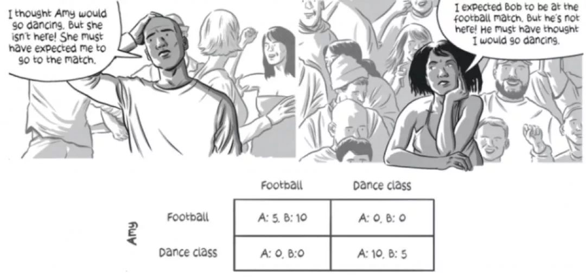

`- 博弈论概要、博弈论分类和要素
- 博弈论三要素—局中人、策略和效用函数
- 纳什均衡
- 混合策略和纳什均衡
- 帕累托最优和纳什均衡
- 机制设计
- 竞价拍卖背后的博弈论原理
- 讨价还价中的博弈
- 什么是 maxmin 和 minmax 策略
- 价格导向的匹配
- 寻找市场结清价格
- 为什么中介在交易过程中具有更多的话语权
- 纳什议价解
- 博弈论小结

浅谈生活中的博弈论(1)—博弈论简介
介绍什么是博弈论，博弈的要素以及博弈的分类。
浅谈生活中的博弈论(2)—博弈论三要素—局中人、策略和效用函数
介绍博弈论三要素—局中人、策略和效用函数
浅谈生活中的博弈论(3)—纳什均衡
介绍博弈论中的纳什均衡
浅谈生活中的博弈论(4)—混合策略和纳什均衡
介绍博弈论中，混合策略下的纳什均衡
浅谈生活中的博弈论(5)—机制设计
介绍博弈论中的帕累托最优

浅谈生活中的博弈论(6)—机制设计
介绍机制合理在日常和工作的重要性

浅谈生活中的博弈论(7)—竞价拍卖
介绍博弈论在竞价拍卖中的应用，会谈到首价密封报价拍卖和次价密封报价拍卖背后理论

浅谈生活中的博弈论(8)—讨价还价中的博弈
简单介绍博弈论在讨价还价中的应用

浅谈生活中的博弈论(9)—maxmin 和 minmax 策略
简单介绍博弈论中的 maxmin 和 minmax 的策略

浅谈生活中的博弈论(11)—价格导向的匹配
介绍博弈论在价格导向的匹配

浅谈生活中的博弈论(12)—寻找市场结清价格
介绍如何寻找市场结清的价格来解决完美匹配问题

浅谈生活中的博弈论(13)—为什么中介在交易过程中具有更多的话语权
介绍为什么中介在交易过程中具有更多的话语权

浅谈生活中的博弈论(14)—纳什议价解(上)
介绍纳什议价解在网络中的议价权中的应用

浅谈生活中的博弈论(15)—纳什议价解(下)
介绍纳什议价解在网络中的议价权中的应用

## 博弈论
今天要说的博弈论是行为主义的第三阶段，在博弈论中，行为主义的智能体是人的本身，关于智能体这一点与强化学习有所不同。博弈论中智能体要优于之前强化学习中的智能体，更接近人类

在行为主义我们主要研究智能体与环境交互，智能体根据环境反馈来更新自己进行学习。

### 什么是博弈

#### 博弈的定义
在生活中，我们或多或少都听过博弈，那么能不能回答一下你对博弈认识呢?好我们先从字面上理解一下**博弈**，其中的**博**，大家可能会联想到赌博，而**弈**自然会想到对弈。
- 赌博
- 棋类游戏
- 竞技游戏
- 运动

其实今天我们讨论的博弈是独立于运气、技术的一种**策略**。很多情况下，更多时候靠策略取胜而不是技术，有的时候大家技术不相上下，难分伯仲时候策略就是称为主导比赛的主要原因。例如篮球中的挡拆战术就是属于博弈，或者比赛要结束时双方比分相差不多时，落后方在比赛最后关头，通通过犯规犯规战术来赢得一次进攻机会来取得比赛最后胜利。**策略**是为了获胜所需要的一种智力技巧。技术都差不多，大家都是考虑策略来赢得比赛。

#### 策略博弈
我们对照强化学习中策略，在强化学习中策略是从**状态到行为映射函数**，而在博弈中策略是一种确定性策略，**策略**本质上涉及与他人的**相互影响**。其他人在同一时间、对同一情形也在进行类似思考。

博弈论就是分析这样的**交互式决策过程**，是关于相互作用情况下的**理性行为**的科学，而强化学习是时序上决策过程。
- 这里交互式决策，不同于强化学习中的**时序决策**

#### 理性行为
- 明白自己的**目的**和**偏好**，同时了解自己行动的限制和约束，以精心策划的方式选择自己的最佳行为，可以理解自私人，参与博弈的人都是理性自私的人，其实我们都不是理性自私人，这样假设是博弈论非常重要前提，如果对方不是理性的自私人，如果对手是大公无私，直接推出比赛让出奖励，那么也就是谈不上什么博弈了，只有这样假设我们才能展开下面研究。

- 理论是在公理上推出的，没有得到验证，得到验证的理论就变成科学
- 博弈论对理性行为为赋予的新的含义，与其他同样具有理性的决策者进行相互作用(发篮球)

#### 在博弈中真的总能获胜吗? 有必胜策略吗?
估计答案你也已经猜到了，没有必胜策略，使用合适的策略可以让我们赢得比赛概率更大而已。例如玩剪刀、石头和布，这就是博弈，没有必胜策略。

#### 博弈策略的分类
- 静态博弈和动态博弈
  - 静态博弈:
  - 动态博弈:下棋
- 竞争博弈和合作博弈
  -  竞争博弈:炒股
  -  合作博弈:结盟
- 完全信息博弈和不完全信息博弈
  - 完全信息博弈: 下棋
  - 不完全信息博弈: 麻将 

### 博弈的要素
一般的博弈问题由三个要素所构成：即局中人(players)又称当事人、参与者、策略等等的集合，策略(strategies)集合以及每一对局中人所做的选择和赢得(payoffs)集合。 其中所谓赢得是指如果一个特定的策略关系被选择，每一局中人所得到的效用。 所有的博弈问题都会遇到这三个要素

#### 局中人(Players)

什么样的人是博弈中局中人，简单理解为参与博弈的人，但是需要满足以下几个条件，

- 在博弈中不存在侥幸心理
- 不可能利用其他局中人的失误来扩展自己的收益
- 以最大化个人利益为目的

#### 策略集合(Strategies)
策略集合有点像强化学习集合，也就是局中人的行为的集合，每一个策略行为方案。在田忌赛马中，田忌赛马策略集合{上中下、上下中、下中上、下上中、中上下、中下上}
$$\cal{S} = \{s_1,s_2,\cdots \}$$

#### 效用函数(Payoff)
##### 局势
也就是**局中人**的策略组合是一个**局势**，在一个局势就可以判断出谁赢谁loss

- 对于每一个参与的博弈的局中人都有一个效应函数
- 通常用 U 字母表示效用函数
- 效用函数在静态博弈中一般是局势的函数
- 在动态博弈中效用函数可能是局势的函数，也可能还有其他因素，比如时间
- 每个局中人的目的都是最大化自己的效用函数

### 经典示例
通过下面几个具有代表性经典博弈论小示例给大家介绍什么是博弈中三要素，局中人、策略集合和效用函数

#### 囚徒困境

囚徒困境是博弈论中经典问题，有两个囚徒有隐瞒未报的偷盗案件，在审问过程中每个囚徒可以选择抗拒不承认或者坦白承认。局势就是两个囚徒给出自己策略算一个局势，那么根据排列组合有(抗拒,抗拒)、(坦白,抗拒)、(抗拒,坦白)和(坦白,坦白) 如果两个人都抗拒不承认每个会判 1 年，如果两个人都坦白每个人会被判 3 年，如果一方坦白另一方抗拒，抗拒判 10 年而坦白会被释放

- 局中人
  - 两个囚徒 
- 策略
  - 抗拒
  - 坦白  
- 效用函数矩阵

|   | 抗拒  | 坦白  |
|---|---|---|
| 抗拒  | -1,-1  | -10,0  |
| 坦白  | 0,-10  | -3,-3  |

##### 性别之战

夫妻两个人看电视，妻子喜欢看舞蹈(换成韩剧也行)，而丈夫喜欢看足球。如何两个达成协议都看舞蹈或者足球，两个人都会有回报，而没有达成一致则双方收益都为 0。

- 局中人
  - 夫妻双方 
- 策略
  - 看足球，看舞蹈
- 纳什均衡
  - 夫妻双方都同意看足球或者舞蹈
  - 纳什均衡解多个纳什均衡解

|   | 舞蹈  | 足球  |
|---|---|---|
| 舞蹈  | 1,2  | 0,0  |
| 足球  | 0,0  | 2,1  |

- 纳什均衡:夫妻同意看舞蹈或者都看足球

##### 剪刀、石头和布(Rock-paper-scissors)

- 局中人
  - 两个玩家 
- 策略
  - 石头、剪刀和布
- 效用函数

- 不存在纳什均衡解

|   |  剪刀 | 石头 | 布 |
|---|---|---|---|
|  剪刀 | 0,0  |  -1,1 | 1,-1  |
|  石头 |  1,-1 |0,0   |  -1,1 |
|  布 |  -1,1 | 1,-1  | 0,0  |

