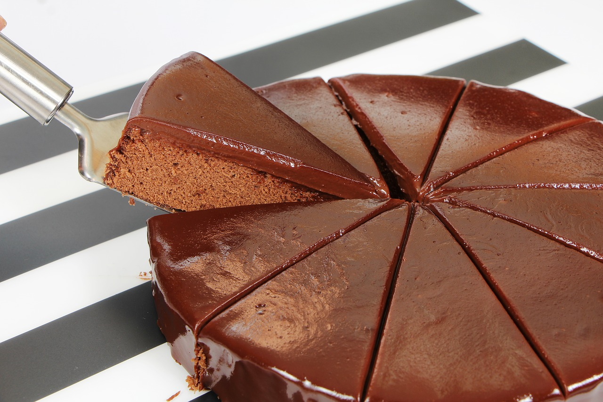
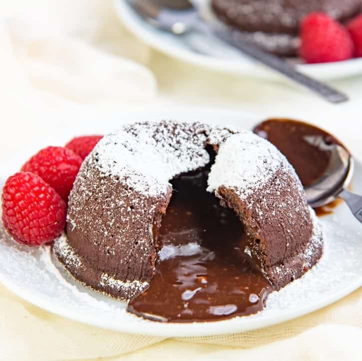

### 讨价

可能大家在实际生活中都少不了讨价还价，对于自己来说应该不善于降价，所以更喜欢去商场购物。可能是性格关系吧。今天我们就谈谈在生活中进行讨价还价，首先我们要清楚买家和卖家博弈区域，也就是在分哪一块利益。可能大家都会讨价还价却不一定知道我们在讨价区间是什么。

- 首先明确讨价是买家和卖家之间的博弈
- 讨价的**对象**是**双方对商品估价之差**，首先要明确讨价对象。

这里一个讨价例子
- 衣服进价 80 标价 200
- 卖家对衣服的估价在 80 和 200 之间，例如 120
- 买家的估价假如 160
- 讨价的对象是双方的估价之差，即 160 - 120 = 40，讨价还价就是分配这 40 元利益
- 如果不满意对方的分割比例，可以提出自己的分割比例

后续的讨论中，将讨价对象，也就是这部分调价空间视为整体 1
- 卖家的估价为 0 位置，买家估价为 1 位置

#### 讨价还价的几种场景

##### 场景 1(一口价)
- take-it-or-leave-it 无商谈余地
- 一方报价，另一方要么接受报价达成交易，要么交易失败
  - 两个人商量吃蛋糕，一方提出切分比例，另一方如果不同意，双方就都不吃
  - 美国参议院和众议员，参议院是每一个州出 2 个人组成参议院，众议员是根据州的人出人，众议员是根据州人数比例，参议院(共和),众议员(民主)党提出增加财政预算到某个值，共和党要么同意，要么拒绝(但不能提出新的方案),谈不拢就会众议员就不提了。
- 通过回滚(rollback)求解**纳什均衡** 
- 找工作就类似此场景

甲方(分配方案提出者)，得到几乎所有利益

过程
- 阶段1: 甲方提出，按照 1-p 和 p 比例进行分配
- 阶段2: 只要 p 大于 0，乙方则会接受

#####  场景 2(三阶段讨价)
- take-it-or-counteroffer 要么接受，要么还价

###### 三阶段讨价
- 甲方报价 1-p,p
- 乙方要么接受报价，要么还价 $\delta \times (1-q),\delta \times q$
- 甲方决定要么接受乙方还价，要么交易失败

###### 约束条件
- **时间成本**: $\delta$ 刻画可用于分配的总收益时间衰减$(0 \le \delta \le 1)$

NBA 劳资谈判，分配一个会融化的蛋糕,今天 NBA，老板报价按比例拿工资

- 第一阶段之后等同 take-it-or-leave-it 讨价
- 假如第一阶段乙方没有接受甲方的报价，那么在接下来的 take-it-or-leave-it，甲方的收益将趋近于 0
- 因此甲方在第一阶段报价时，分配给乙方的收益不少于乙方拒绝报价所得到收益
$$p \ge \delta \times (1-q) 近似 \delta$$
- p 甲方第一轮报价中，乙方获得的收益
- 甲方第一轮报价被拒绝后，乙方报价时将获得的收益
- 一旦让乙方报价 q 就会接近 0 
- 这样报价就会放甲方充分考虑乙方，

take-it-or-counteroffer 过程推演的启示
- 在时间成本的约束下，甲乙双方会尽可能在第一轮达成交易，以使共同分割的收益总和最大
- 甲方在第一轮报价时，需要根据时间成本来决定报价
- 乙方获得收益依赖对时间成本的容忍度
- 最终的分配比例是  
  - 甲方 $1-\delta$
  - 乙方 $\delta$ 

蛋糕融化越慢，乙方就收益越多

- 先发优势，还是后发制人?
- 当时间成本较高($\theta$ 较小)时，甲方先发优势
  - 夏天蛋糕融化快 
- 当时间成本较低，乙方可后发制人

#### 公司里领导
网络中通路如果不经过领导，那么领导就被架空了