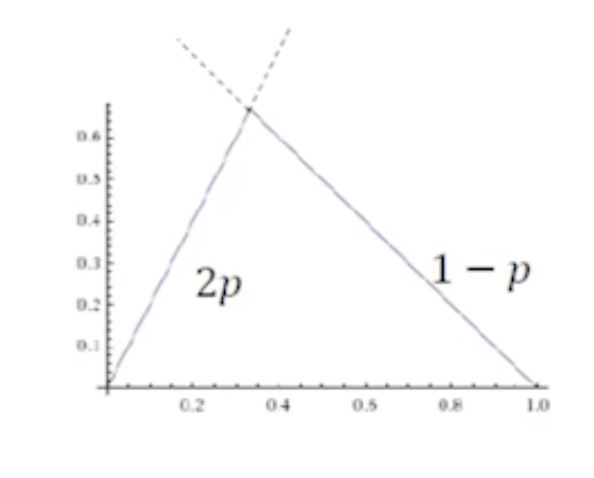
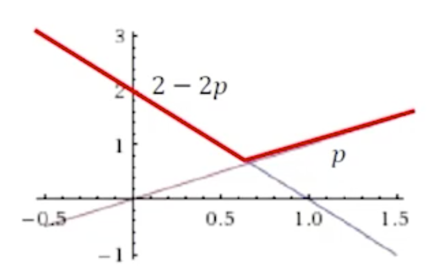

在博弈论中，每一个局中人在提出策略，这种策略不仅依赖自己理性行为也依赖于对方理性行为。所谓最大最小策略就是让自己最小收益最大化。今天会从两个角度来考虑在博弈中，局中人如何制定自己策略让自己收益最大或者回避风险。

囚徒困境是博弈论中经典问题，有两个囚徒有隐瞒未报的偷盗案件，在审问过程中每个囚徒可以选择抗拒不承认或者坦白承认。局势就是两个囚徒给出自己策略算一个局势，那么根据排列组合有(抗拒,抗拒)、(坦白,抗拒)、(抗拒,坦白)和(坦白,坦白) 如果两个人都抗拒不承认每个会判 1 年，如果两个人都坦白每个人会被判 3 年，如果一方坦白另一方抗拒，抗拒判 10 年而坦白会被释放

|   | 抗拒  | 坦白  |
|---|---|---|
| 抗拒  | -1,-1  | -10,0  |
| 坦白  | 0,-10  | -3,-3  |

囚徒困境中，可是双方存在一个非常稳定的**占优策略**，每个囚徒选择抗拒是为了避免自己陷入到利益受损最大的境地，因为在选择抗拒一旦采取了坦白，这样该局中人就会遭受更大损失，如果事先商量好了可以选择抗拒，但是前提相互信任，或是通过某种手段来保证其。无论对方采取坦白还是抗拒自己坦白都是让自己最小利益最大化的保守策略，但是这样显然对于双方都是不是最佳的。这是就是个人理性和团体理性存在激烈冲突

### maxmin 策略
- 最大化自己最坏情况时的效用(收益)，这时候只关心自己下界收益，而不去关心其他局中人，这样以来就可以忽略局中人的数量。

$$\arg \max_{s_i} \min_{s_{-i}} u_i(s_i,s_{-i})$$
- $u_i(s_i,s_{-i})$ 局中人 i 的效用函数
- $s_i$ 局中人 i 的策略
- $s_{-i}$ 除 i 之外其他局中人的策略

max 就是优化自己下界，就是让自己收益下界最大化$ \min_{s_{-i}}$ 表示其他人想让 i 收益最小，在这种情况下 i 最大化 $\min_{s_{-i}}$, 第 i 局中人就是让其自己最差收益最大。

#### 性别大战

夫妻两个人看电视，妻子喜欢看舞蹈(换成韩剧也行)，而丈夫喜欢看足球。如何两个达成协议都看舞蹈或者足球，两个人都会有回报，而没有达成一致则双方收益都为 0。

|   | 舞蹈  | 足球  |
|---|---|---|
| 舞蹈  | 1,2  | 0,0  |
| 足球  | 0,0  | 2,1  |

- 妻子的策略: 以概率 p 选择舞蹈，以概率 1 - p 选择足球
- 丈夫的策略: 以概率 q 选择舞蹈，以概率 1 - q 选择足球
- 妻子的期望收益
$$u_w(p,q) = 2pq + (1-p)(1-q) = 3pq - p - q + 1$$
$$q(3p-1)-(p-1)$$

- 妻子的期望收益关于丈夫的策略 q 是单调的
  - 最小值可能取值点: $q = 0$ 或 $q=1$
- 妻子的最坏期望收益  
$$\min_q u_w(p,q) = \min(1-p,2p)$$
- 妻子的 maxmin 策略为
$$\arg \max_{p} \min_{q} u_w(p,q)$$

$p=\frac{1}{3}$ 看舞蹈，$\frac{2}{3}$ 看足球

#### maxmin 的好处
- 最小化损失，控制风险
- 规避风险
- 在做高频交易人，一直在赚钱，他们就是采取的是maxmin算法

### minmax 策略
不从自己角度考虑，最小化对手的最大收益，

$$\arg \min_{s_i} \max_{s_j} U_j(s_i,s_j)$$
- $U_j$ 对手效用函数
- $s_j$ 表示对手策略
- $s_i$ 表示局中人策略

- 丈夫的期望收益
$$u_h(p,q) = pq + 2(1-p)(1-q) = 3pq - 2p - 2q + 2$$

- 丈夫的期望收益关于丈夫的策略 q 是单调的
  - 最小值可能取值点: $q = 0$ 或 $q=1$

- 丈夫的最好期望收益  
$$\max_q u_h(p,q) = \min(2-2p,p)$$
- 妻子的 maxmin 策略为
$$\arg \min_{p} \max_{q} u_h(p,q)$$

$p=\frac{2}{3}$ 看舞蹈，$\frac{1}{3}$ 看足球