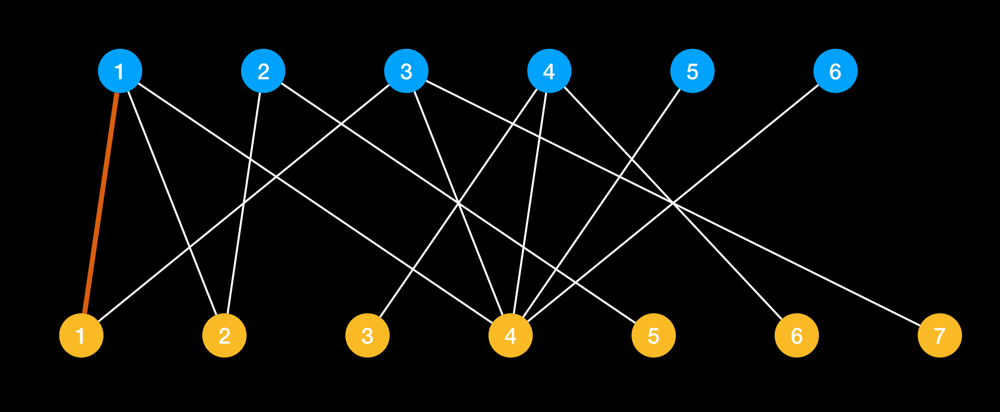

### 匹配问题(matching)
- 分任务
- 找对象
- 分宿舍

今天大家更关注、更关心一些模式识别问题，而忽略一些像匹配问题这样机器学习问题。

在开始匹配问题，我们先介绍一些概念
##### 匹配概念

匹配是由一组没有公共端点的不是圈的边构成的集合。
-  匹配是边的集合
-  在集合中，任意两条边不能有共同的顶点

首先我们来看匹配是基于图的一种概念。

##### 最大匹配
一个图所有匹配中，所含匹配边数**最多的匹配**，称为这个图的最大匹配。

##### 完美匹配
如果一个图的匹配中，所有顶点都是匹配点，那么就是完美匹配
<!-- 
考虑部集合为 $X = \{x_1,x_2,\cdots \}$ 和 $Y = \{y_1,y_2,\cdots\}$ 的二部图，一个完美匹配是定义从 $X-Y$ 的一个双射，依次为$x_1,x_2,\cdots$ 找到配对的顶点，最后能够得到 $n!$ 个完美匹配 -->

不难看出，完美匹配一定是最大匹配，而最大匹配不一定是完美匹配。有一些情况我们是做不到完美匹配，只能尽量实现最多的匹配，这个就叫做最大匹配

##### 二部图
给定两组顶点，但是组内的任意两个顶点间没有边连接，只有两个集合之间存在边，所有边都跨越组的边界，则这就是一个二部图

##### 交错路径
在图 G 的一个匹配 M，如果一条路径的边交替出现在 M 中和不出现在 M 中，我们称之为一条 **M 交错路径**，依次经过非匹配边、匹配边、非匹配边…形成的路径叫交替路。

##### 增广路径
如果一条 M 交错路径，他的两个端点都不与 M 中的边关联，我们就称这条路径叫做增广路径

那么找最大匹配也就是找增广路径的问题。

增广路有一个重要特点：非匹配边比匹配边多一条。因此，研究增广路的意义是改进匹配。只要把增广路中的匹配边和非匹配边的身份交换即可。由于中间的匹配节点不存在其他相连的匹配边，所以这样做不会破坏匹配的性质。交换后，图中的匹配边数目比原来多了 1 条。

我们可以通过不停地找增广路来增加匹配中的匹配边和匹配点。找不到增广路时，达到最大匹配（这是增广路定理）。匈牙利算法正是这么做的。在给出匈牙利算法 DFS 和 BFS 版本的代码之前，先讲一下匈牙利树。

#### 匈牙利算法

在一个匹配都没有情况下，我们随意匹配一条边$(x_1,y_1)$，构建最初的匹配出来

然后为 $x_2$ 匹配出一条边为 $(x_2,y_2)$

当要匹配 $x_3$时候，发现 $y_1$ 已经和 $x_1$ 匹配上了，所以让 $x_1$ 断开和 $y_1$ 匹配去重新匹配，$x_3$ 也可以和$y_4$和$y_7$ 匹配，不过这里还是先，而且最大匹配并不唯一

这里争论与妥协的过程，我们可以把涉及到结点拿出来 $(x_3,y_1,x_1,y_2,x_2,y_5)$ 很明显是一条路径 P
而在第二步中，我们已经形成了匹配 M 而 P 呢? 回忆一下增广路径，发现 P 原来是 M 的一条增广路径

匈牙利算法寻找最大匹配，核心是找增广路径。

就是通过不断寻找原有匹配的 M 的增广路径，因为找到一条 M 匹配的增广路径，就意味着一个更大的匹配 M 其恰好比 M 多一条边

对于图来说，最大匹配不是唯一的，但是最大匹配的大小是唯一的。

### 完全匹配
对于两类结点集合大小一样的二部图，选择数目和结点个数一样的边，使得每类结点中的任意一个结点在另一个结点中都有唯一的对应结点

- 如何判断一个二部图是否存在完全匹配呢?
  - 如果存在，找到即可

#### 匹配定理
对于左右两部结点数相同的二部图，如果其不存在完全匹配，那么该二部图一定包含一个受限集
#### 受限集
假设 S 是二部图某部结点集的子集，$N(S)$ 是 S 的邻居结点集合(注意: 该集合的结点一定来自二部图的另一部结点集合)，如果$N(S)$ 中的结点个数 $|N(S)|$ 小于 S 中结点数$|S|$ 即$|N(S)| < |S|$ 则称 S 为受限集

例如 5 人想住房间只有 3 个

- 而且受限集总是成对出现的，

#### 一般的匹配问题
- 前面的宿舍分配问题中，每个人只列出可接受的房间，更一般的情形是每个人对房间给出一个估价
- 前面的例子可以看成一个打分为 0 和 1 的特例

| room  | student  | score  |
|---|---|---|
|  1 | Xin  | 12,2,4  |
|  2 | Yoram  | 8,7,6  |
|  3 | Zoe  | 7,5,2  |

- 通过取一个阈值来将数字变为二值问题

#### 最优匹配
- 匹配的效用: 成功匹配的估价之和，称为匹配的效用
- 最优匹配: 效用最大的匹配
- 最优匹配对于个体而言不一定最优，甚至是最差的

$$12 + 6 + 5 = 23$$

- 如何快速找到最优的解
  - 遍历所有情况
  - 有更高效方法
  - 需要宿舍管理员这样

#### 价格导向的匹配

¥¥¥