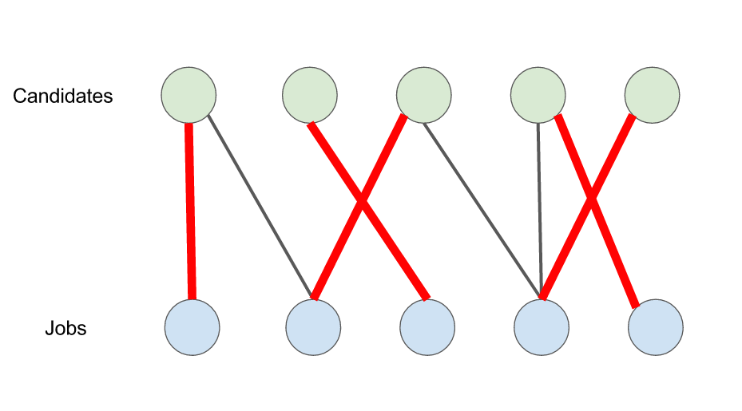

##### 匹配概念

匹配是由一组没有公共端点的不是圈的边构成的集合。
-  匹配是边的集合
-  在集合中，任意两条边不能有共同的顶点

首先我们来看匹配是基于图的一种概念。

##### 最大匹配
一个图所有匹配中，所含匹配边数**最多的匹配**，称为这个图的最大匹配。

##### 完美匹配
如果一个图的匹配中，所有顶点都是匹配点，那么就是完美匹配

### 完全匹配
对于两类结点集合大小一样的二部图，选择数目和结点个数一样的边，使得每类结点中的任意一个结点在另一个结点中都有唯一的对应结点

- 如何判断一个二部图是否存在完全匹配呢?
  - 如果存在，找到即可

#### 匹配定理
对于左右两部结点数相同的二部图，如果其不存在完全匹配，那么该二部图一定包含一个受限集
#### 受限集
假设 S 是二部图某部结点集的子集，$N(S)$ 是 S 的邻居结点集合(注意: 该集合的结点一定来自二部图的另一部结点集合)，如果$N(S)$ 中的结点个数 $|N(S)|$ 小于 S 中结点数$|S|$ 即$|N(S)| < |S|$ 则称 S 为受限集

例如 5 人想住房间只有 3 个

- 而且受限集总是成对出现的，

#### 一般的匹配问题
- 前面的宿舍分配问题中，每个人只列出可接受的房间，更一般的情形是每个人对房间给出一个估价
- 前面的例子可以看成一个打分为 0 和 1 的特例

| room  | student  | score  |
|---|---|---|
|  1 | Xin  | 12,2,4  |
|  2 | Yoram  | 8,7,6  |
|  3 | Zoe  | 7,5,2  |

- 通过取一个阈值来将数字变为二值问题

#### 最优匹配
- 匹配的效用: 成功匹配的估价之和，称为匹配的效用
- 最优匹配: 效用最大的匹配
- 最优匹配对于个体而言不一定最优，甚至是最差的

找到一种匹配是效用最大的，一定会匹配只是匹配好坏的问题
$$12 + 6 + 5 = 23$$

##### 如何快速找到最优的解
- 遍历所有情况
- 有更高效方法
- 需要宿舍管理员这样全局角色—价格
- 将算法问题变为经济学问题

#### 价格导向的匹配
- 价格导向的匹配问题的形式化表示

价格: 通过为宿舍定价 

$$\begin{bmatrix}
    P_a,P_b,P_c
\end{bmatrix}$$

估价

$$v = \begin{bmatrix}
    v_{x,a} & v_{x,b} & v_{x,c}\\
    v_{y,a} & v_{y,b} & v_{y,c}\\
    v_{z,a} & v_{z,b} & v_{z,c}\\
\end{bmatrix}$$

#### 价格导向的匹配
**估价**不低于价格时，买方可以接受
- 如果 $v_{x,a} \ge P_a$ 则买方 x 可以接受卖方 a 的价格，如果成交，买方 x 获取的效用

$$v_{x,a} - P_a$$
- 对于买方 $x$ 如果使其效用最大的卖方是 a，那么在二部图中添加一条由 x 指向 a 的边
- 对于同一个买方，如果有多个卖方使其效用最大，则添加多条边
- 最终得到一个**买方偏好图**

$$v = \begin{bmatrix}
    v_{x,a} & v_{x,b} & v_{x,c}\\
    v_{y,a} & v_{y,b} & v_{y,c}\\
    v_{z,a} & v_{z,b} & v_{z,c}\\
\end{bmatrix}$$

在 $\{5,2,0\}$ 定价策略就让大家都找到自己房间

这样买方偏好图，是不完全匹配，存在 $\{x,z\}$ 受限集

#### 市场结清价格
- 市场结清价格(Market-Clearing)
买方和卖方都成交了
在给定买方报价的情况下，如果卖方的某种价格使得对应的买方偏好图中存在完全匹配，则称卖方的这组价格为**市场结清价格**。

##### 如何找到事情
- 未实现市场结清的价格
- 没有完全匹配就是说明市场结清价格

##### 市场结清价格的性质
- **最优性**: 市场结清价格所对应的买方偏好图中得到的完全匹配是最优匹配
- **存在性**: 对于任意买方估价，市场结清价格一定存在
只要人数和资源数相同一定存在一个

##### 市场结清价格的存在性
- 寻找市场结清价格的过程
  - 初始时，所有卖方的的价格都为 0
  - 构建**买方偏好图**，买方偏好图是一个 binary 问题，检查其是否存在**完全匹配**
    - 如果存在,当前价格就是市场结清价格，推出程序
    - 如果不存在，从图中找到一个受限集 S(一定是买方)及其邻居$N(S)$,让$N(S)$中的每个卖家的价格增加 1
  - 回到**上一步**(当所有价格都为正时，可以通过让所有价格减去最低价格，使最低价格为0，此操作不影响结果)
- 收敛性
  - 买卖双方的总收益有限
  - $|N(S)| < |S|$，总收益下降，但不会小于 0  

##### 寻找市场结清价格

- 受限集$S=\{x,y,z\},N(s) =\{a\}$
- 受限集$S=\{x,z\},N(s) =\{a\}$

- 受限集$S=\{x,y,z\},N(s) =\{a,b\}$

##### 市场结清价格的存在性
- 完全匹配是否存在可以通过寻找受限集来判断
- 价格能够引导市场优化配置
- 市场结清价格总是存在
- 市场结清价格使得买卖双方总效用最优