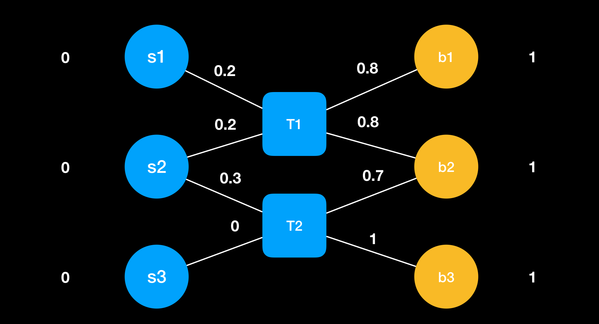
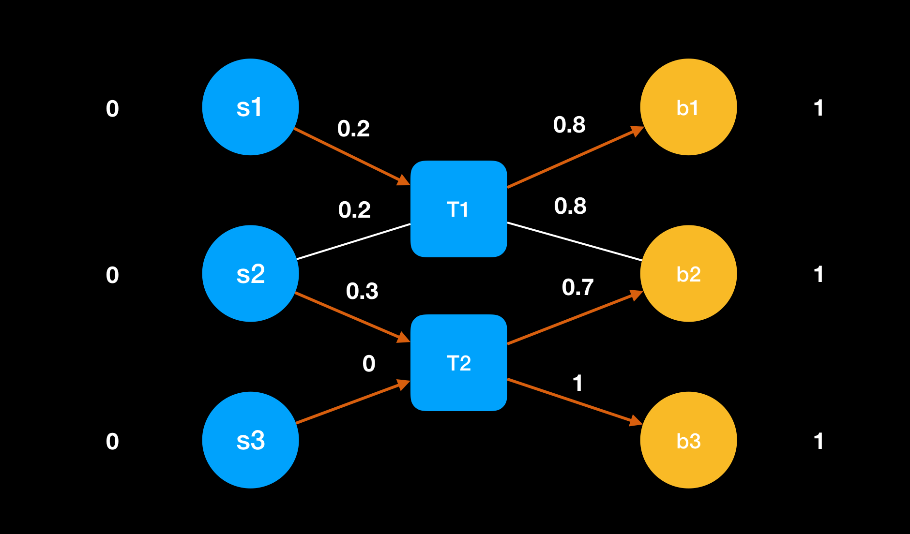
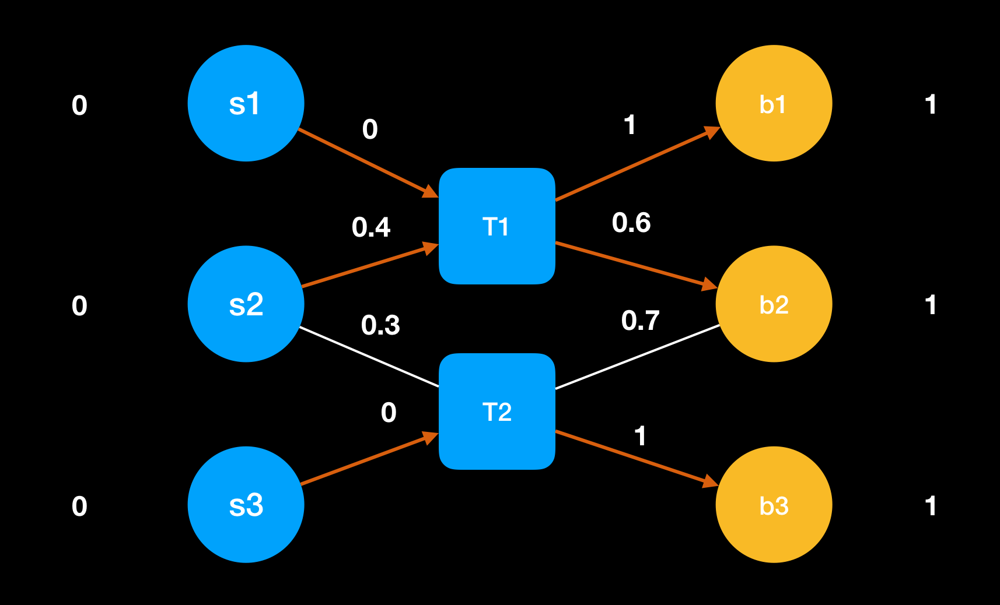

### 中介市场
- 闲鱼
- 链家和贝壳
- 58 同城

#### 中介市场博弈规则
- 中介向买方、卖方报价
- 买方和卖方根据中介报价选择是否交易

- T1 可能会将和 S1 交易价格修改为 0 因为 S1 完全受控与 T1，然后为了 T2 竞争将给 S2 报价提升到 0.4
- T2 也会提升

#### 中介市场的均衡态
- 买方和卖方的策略是确定的(首价竞拍)，且为中介所知
- 中介之间进行博弈

##### 垄断
- T1 垄断和 s1、b1 的交易， T2 垄断和 s3、b3 的交易
##### 充分竞争
- T1 和 T2 在和s2、b2 的交易中充分竞争