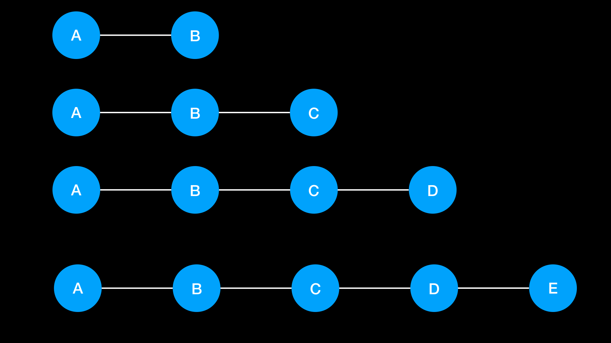
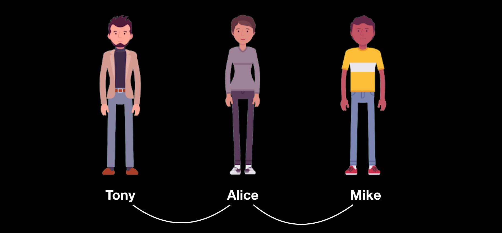
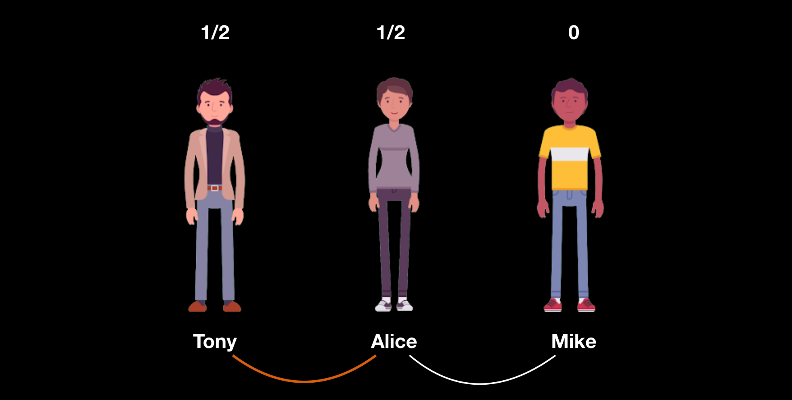
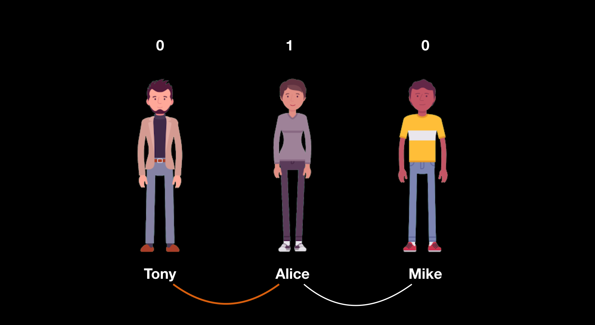
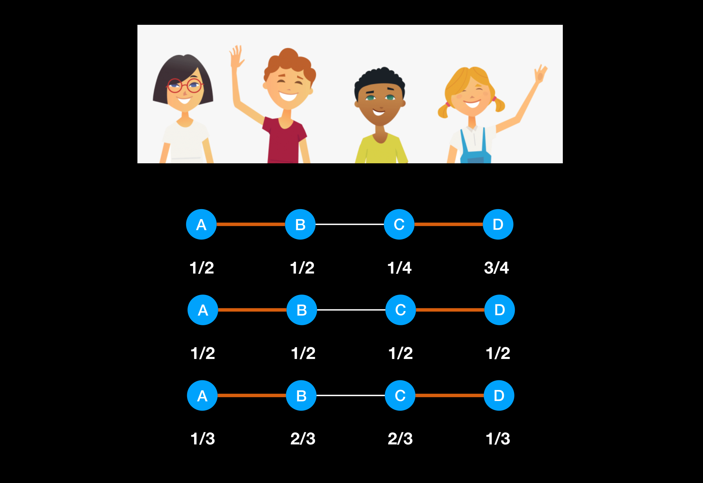
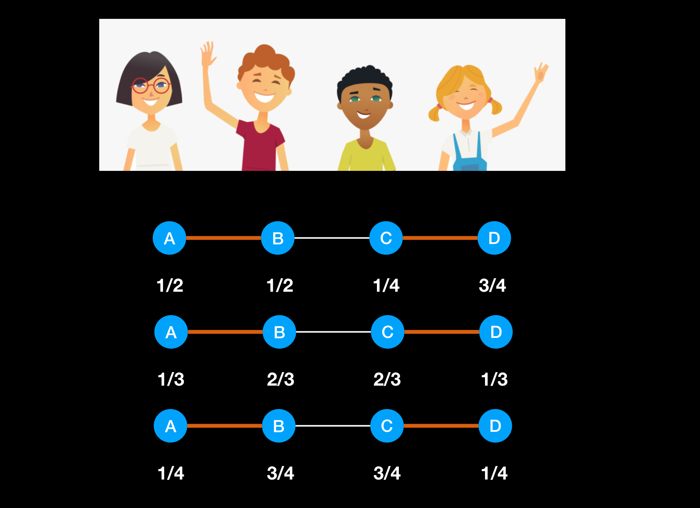

### 议价权
#### 网络中结点位置的重要性
- 结点在网络中所处的位置不同，导致其在博弈中权利不同，这里权利是**议价权**

- C 觉得自己位置很重要，其实市场觉得其位置不重要

#### 网络交换博弈(Network Exchange)
##### 找朋友游戏
- 给定一个网络，每个结点代表一个人
- 每个人选择一个人作为自己的好友(Best friend)
- 达成好友的两个人，可以分配价值为 1 的东西
- 每个人可以选择好友对方报价
##### 游戏结果
- 结点配对结果和每个结点的收益构成
配对结果是
- A 和 B 配对 C落单
- 收益是 A 和 B 个 1/2
- C 收益为 0

#### 结局的稳定性
##### 不稳定
- 对于结局中未参与配对的边，如果边的两端点获得的收益只和小于 1 ，则称这条边为不稳定边
- 不稳定边的存在意味着其两个端点可以通过改变报价而改变结局

##### 稳定结局
- 如果一个结局中不存在不稳定边，则称该结局为稳定结局

是在没有成交这条边是否还有议价空间，找到未匹配的边，未参与

- 在 B,C 认为自己没有得到应有价格，因为他们位置很重要，而在 2 中他们是均分的 1/2。

- 在纳什贡献在稳定中 3 要优于 2，在纳什之前大家就已经直到稳定问题，B,C 在结构中位置一定比 A 和 D 重要。

#### 网络中的议价权

##### 有备选项的议价
- A 和 B 二人议价，确定分配比例
- A 的备选项收益为 x
- B 的备选项收益为 y
- 要求 $x + y \le 1$；否则 A 和 B 达不成交易

##### 纳什议价解
- 议价的对象，**剩余价值**如何分配 $s = 1 - x - y$

##### 纳什议价解
- A 的收益是 $x + \frac{s}{2} = \frac{1+x-y}{2}$
- B 的收益是 $y + \frac{s}{2} = \frac{1+y-x}{2}$

$$x + \frac{s}{2} = \frac{2x + 1 - x -y}{2} = \frac{1+x-y}{2}$$

#### 均衡结局
- **均衡结局**: 给定一个结局，如果结局中的任意一个参与配对的边都**满足纳什议价解**的条件，则称该结局是均衡结局
- 均衡结局一定是稳定结局
- 因此，在寻找均衡结局时，可以先寻找稳定结局，进而确定均衡结局

