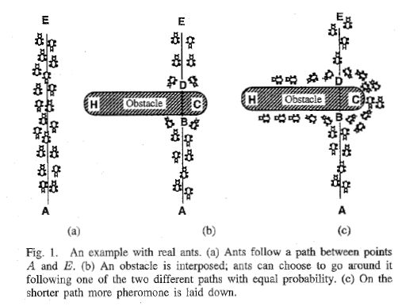
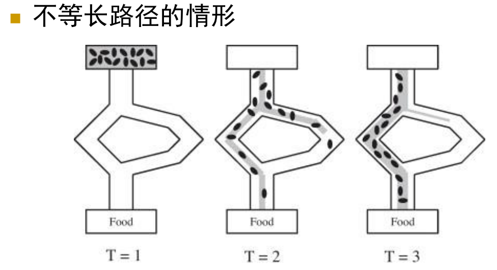

- 高级人工智能(1)—ACO 蚁群优化算法
介绍人工智能几个阶段，符号主义、联接主义和行为主义，然后简单介绍群体智能中的ACO 蚁群优化算法
- 高级人工智能(2)—旅行商问题的蚁群优化求解
介绍蚁群优化算法以及旅行商问题的蚁群优化求解

知识表示和推理
- 知识表示
- 知识推理

### 高级人工智能
- **符号主义**: 规则驱动的确定性人工智能
    深蓝就是在解空间搜索能力大于人类
- **联接主义**: 数据驱动的不确定性人工智能
    交小朋友认识猫咪，我们并不是通过语言来描述一只猫，如果根据语言描述或者符号化，很多人就会找到一些东西也符合你的描述，但是并不是猫的生物或者东西。我们会给小朋友看猫的影像或者当遇到猫时候，告诉小朋友这就就是猫(监督学习)，小朋友学习过程，而且小朋友还会联想，小朋友联想能力，往往这些无法给出确定的描述(符号定义)。神经网络就是采用这种方式来学习，通过大量代表标注的数据来训练一个神经网络。
    所以说有多少智能就有多少人工
- **行为主义**: 交互驱动的不确定性人工只能
  - 强化主义 
  - 交互就是反馈
  - 到今天**强化学习**还是处于初级阶段
  - 强化学习的框架经过上个世纪，不好训练
  - AlphaGo

#### 下一代人工智能
- 行为主义
- 符号主义+联接主义


### 群体智能
- 群体智能，没有智能或者只有相对简单智能的主体，通过合作**涌现**出更高的智能行为的特征。
- 复杂个人也可以实现功能，同样可以由简单个体通过群体合作完成同样功能，后者优势是更加健壮、灵活和经济。
- 群体智能利用群体优势，在没有中心控制条件下，寻找解决问题的新思路
- 这里问题大部分都是决策层面上问题，**博弈论**也是群体智能的体现方式

#### 涌现
在复杂系统中的涌现是一种统计思维，单个蚂蚁是简单生物，但是当蚂蚁数量达到一定数量，可以高度智能化行为
- 神经元达到一定数量，具有高度

### 群体智能的应用
- 群体智能在搜索引擎上应用


### 群体智能
- **集群智能**: 众多的无智能个人，通过相互之间简单和合作出现智能行为
- **博弈**: 具备一定智能的理性个人，按照某种机制行为，在群体层面体现出的智能
- **众包**: 设计合适的机制，激励个体参与，从而实现单个个体不具备的社会智能，共享单车，解决出行难的1问题，如何机制设计来产生智能

### 集群智能
- **集群智能**是分布式、自组织的(自然/人造)系统表现出的一种群体智能
- 集群智能系统一般由一群简单的**智能体**构成，智能体按照简单的规则彼此进行局部交互，智能体也可以环境交互


- 大雁
- 鱼群
- 蚂蚁


- 蜜蜂


<!-- #### 莱特兄弟飞机
人们看到鸟儿在天上飞，所以也想像鸟儿一样在天空上自由飞翔。所以人类前仆后继投入到人类飞行的。
开始人类是模仿鸟飞行，结果都识别了，空气动力学。当飞机飞上天时候有人，当有人
莱特兄弟他们也不是物理学家，工程在前研究在后的，

所谓仿生学，其实对于具体实现通过发明飞机过程大家都清楚了，我们发明飞机仅仅是看到鸟儿天上飞收到启发和灵感，并不是研究鸟儿飞原理而发明出飞机 -->





#### 蚁群优化算法
蚁群觅食，不等长路径的情形，蚂蚁是没有记忆的，路径选择问题。蚁群优化算法。没有决策随机选择，找到食物就返回。第一个蚂蚁也就是最优路径的蚂蚁，随着蚂蚁移动过程会留下信息素。

#### ACO(Ant Colony Optimization)
- 一种解空间搜素方法
- 适用于在图上寻找最优路径
- 与环境或者个人交互来学习
- 找到最大路径，依靠**信息素**

#### 蚁群优化算法
##### 形式化
- 每个蚂蚁对应一个计算智能体
- 蚂蚁依概率选择候选位置进行移动
- 在经过的路径上留下**信息素(Pheromone)**
- 信息素随时间挥发
- 信息素浓度大的路径在后续的选择中会以更高的概率被选取

#### 概念-形式化-代码


##### 旅行商问题(TSP: Traveling Salesman Problem)
- n 个城市的有向图 $G=(V,E)$
- $V = \{1,2,\cdots,n\}$ $E=\{(i,j)|i,j \in V\}$
- 城市之间的距离表示为 $d_{ij}$ 为结点 i 和 j 之间的距离
- 目标函数 $f(w) = \sum_{i=1}^n d_{i_l,i_{l+1}}$ 其中 $w=\{ i_1,i_2,\cdots,i_n\}$ 为 TSP 问题的任意可行解，其中 $i_{n+1} = i_1 $
- 离散优化问题，通过排列组合就还可以计算
- n 座城市可能路径 $\frac{(n-1)!}{2}$

#### 旅行商问题的蚁群优化求解

- 将 m 蚂蚁放置结点，蚂蚁根据概率进行移动

$$p_{ij}^k(t) = \frac{(\tau_{ij}(t))^{\alpha}(\eta_{ij}(t))^{\beta}}{\sum_{k \in allowed}(\tau_{ik}(t))^{\alpha}(\eta_{jk}(t))^{\beta}}$$

- $\tau_{i,j}(t)$ 表示$(i,j)$上的**信息素**浓度
- $\eta_{i,j}(t) = \frac{1}{d_{ij}}$ 根据距离定义的**启发信息**，距离 i 和 j 之间的距离比较近
- $\alpha$ 和 $\beta$ 反映了**信息素**与**启发信息**的相对重要性，也可以线性插值法

- 如果 otherwise 则为 0 


#### 更新信息素浓度

$$\Delta \tau_{ij}^k = f(x) = \frac{Q}{L_k} ,(i,j) \in w_k$$

当所有蚂蚁走走一圈之后，一圈越长信息素会平分路径，

$$\tau_{ij}(t+1) = \rho \tau_{ij}(t) + \Delta \tau_{ij}$$

$$\Delta \tau_{ij} =\sum_{k=1}^m \Delta \tau_{ij}^k $$

其中
- $Q$ 为常数
- $w_k$ 表示第 k 只蚂蚁在


总结
- 蚁群算法是逐渐优化的算法
- 可以设置路径最小阈值
- 可以设置最小迭代次数
<!-- TSP 问题蚂蚁群算法流程
- 初始化，随机放置蚂蚁
- 迭代过程
```python
k-1
while k < ItCount do
    for i = 1 to m do:
        for j = 1 to n-1 do:
        
        end for
    end for
k = k+1
```

理性个人，就是假想数学概念，其实我们每个人都认为自己是理性，其实真实是理性的人吗 -->

#### 蚁群优化算法小结
思想:局部随机搜索结合自增强，强化学习信息素
缺点
- 收敛速度慢
- 易于陷入局部最优
- 对于解空间为连续的优化问题不适用

### 教育小孩
- 设置奖励是为实现最终目标
- 智能体的设计者和智能体唯一的交互