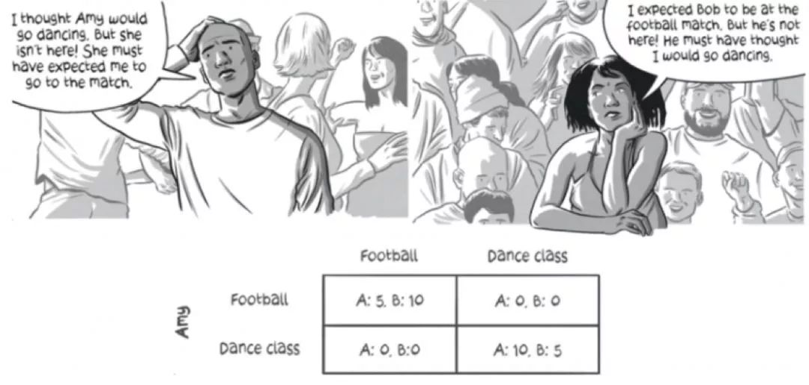

##  囚徒困境

#### 问题描述
囚徒困境是博弈论中经典问题，有两个囚徒有隐瞒未报的偷盗案件，在审问过程中每个囚徒可以选择**抗拒**不承认或者**坦白**承认。局势就是两个囚徒给出自己策略算一个**局势**，那么根据排列组合局势有

- 抗拒,抗拒
- 坦白,抗拒
- 抗拒,坦白
- 坦白,坦白 

如果两个人都抗拒不承认每人会被判 1 年，如果两个人都坦白每个人会被判 3 年，如果一方坦白另一方抗拒，抗拒一方会被判 5 年而坦白会被释放。

##### 局中人:
两个囚徒 
##### 策略
抗拒或者坦白  
##### 效用函数矩阵

|   | 抗拒  | 坦白  |
|---|---|---|
| 抗拒  | -1,-1  | -5,0  |
| 坦白  | 0,-5  | -3,-3  |

每个人都会选择最大化自己受益的最大化策略，那么对于囚徒最大化受益就是服刑时间最短，为了这个目的怎样的策略才是理性的呢?

对于囚徒(A 囚徒)做出策略时还需要考虑到另一个囚徒(B 囚徒)的策略选择，那么 B 囚徒选择有两种可能分别是抗拒或者是坦白，这里就称为 B 囚徒，如果 B 囚徒坦白的前提，A 囚徒如果坦白将服刑 3 年如果抗拒则服刑 5 年，所以 A 最佳选择是认罪。

假设前面策略 A 囚徒选择了抗拒情况，B 囚徒选择坦白收益为 0，当 A 囚徒选择坦白情况，B 囚徒也会选择坦白获取去收益最大。

对于 A 囚徒无论 B 囚徒做出什么策略，坦白都是 A 囚徒的占优策略。两个囚徒都不能通过单方面改变策略来增加自己的效益，因此谁都没有游离这个策略组合的动机。

#### 占优策略

在选择策略时，有一个策略的效用总是大于其他所有策略效用时，我们就把这类策略称为占优策略(Dominant Strategy)

### 占优策略纳什均衡

当所有参与者的最优回应是选择他们的占优策略时，这时达到的纳什均衡称为占优策略纳什均衡。

#### 占优策略

##### 性别之战

夫妻两个人看电视，妻子喜欢看舞蹈(换成韩剧也行)，而丈夫喜欢看足球。如何两个达成协议都看舞蹈或者足球，两个人都会有回报，而没有达成一致则双方收益都为 0。

- 局中人
  - 夫妻双方 
- 策略
  - 看足球，看舞蹈
- 纳什均衡
  - 夫妻双方都同意看足球或者舞蹈
  - 纳什均衡解多个纳什均衡解

|   | 舞蹈  | 足球  |
|---|---|---|
| 舞蹈  | 1,2  | 0,0  |
| 足球  | 0,0  | 2,1  |

- 纳什均衡:夫妻同意看舞蹈或者都看足球

##### 剪刀、石头和布(Rock-paper-scissors)

- 局中人
  - 两个玩家 
- 策略
  - 石头、剪刀和布
- 效用函数

- 不存在纳什均衡解

|   |  剪刀 | 石头 | 布 |
|---|---|---|---|
|  剪刀 | 0,0  |  -1,1 | 1,-1  |
|  石头 |  1,-1 |0,0   |  -1,1 |
|  布 |  -1,1 | 1,-1  | 0,0  |

