## 元宇宙那些事—是一次对真实世界的超越

最近在抖音上无意间听到一期关于元宇宙的视频，听完之后自己也想对这个新生事物进一步地了解一下。因此翻阅了一些资料，观看了一些相关的视频。

基于收集到的一些资料，今天也想聊一聊什么是元宇宙? 本次的分享目的想通过介绍元宇宙让大家多少对这个新名词有所了解。由于个人认知有限，还希望大家在评论区给出自己对元宇宙的认知。

#### 从字面上来理解什么是元宇宙

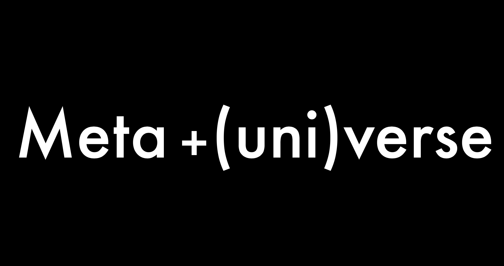

元宇宙的英文是 metaverse，是 meta 和 universe 的组合，其中 meta 有超越的意思，verse 是宇宙意思。之前在 meta programming 是元编程，meta learning 是元学习中接触过 meta 这个词。

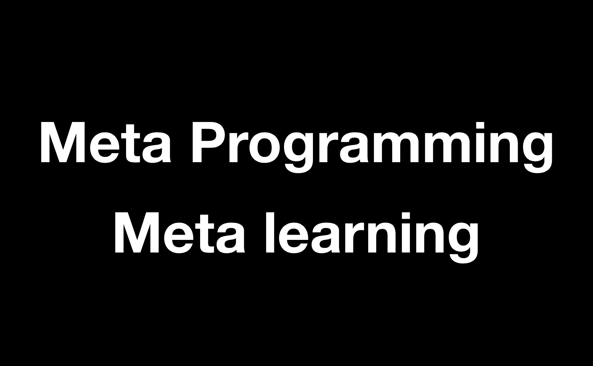

 meta programming 直译为元编程，作为程序员的我多少什么是元编程，这里元编程是用代码编写代码意思。机器学习新兴的 meta learning 是让机器学习如何学习意思，正确地理解 meta 对于理解什么是元宇宙有所帮助。

那么这里元宇宙就是希望打破现实生活中的各种局限，借助元宇宙概念去开发一个虚拟的共享空间。从而去创建一种新的文明和共识。

#### 元宇宙今天到底有多火

在开始介绍元宇宙之前，我们先看一看元宇宙现在发展的状况，
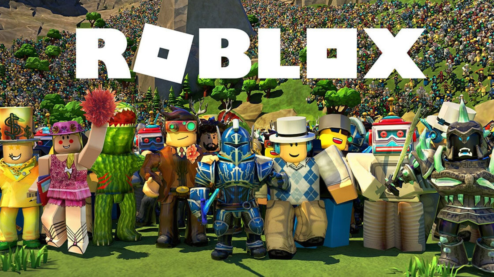

- 在 3 月 10 日 Roblox 盛装上市，股票暴涨，市值到底 476 亿美元。Roblox 公司本身不只是游戏，还是一个提供游戏创作以及游戏上线的平台。就是 Roblox 的上市标志将元宇宙概念带入了投资者视野。

- 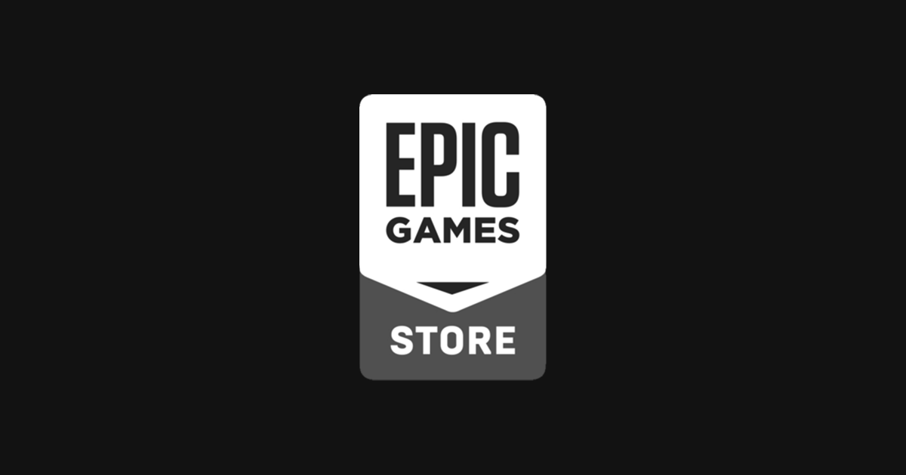

- 堡垒之夜的开发游戏公司 Epic Games 高调融资 10 亿美元来发展元宇宙产业。
  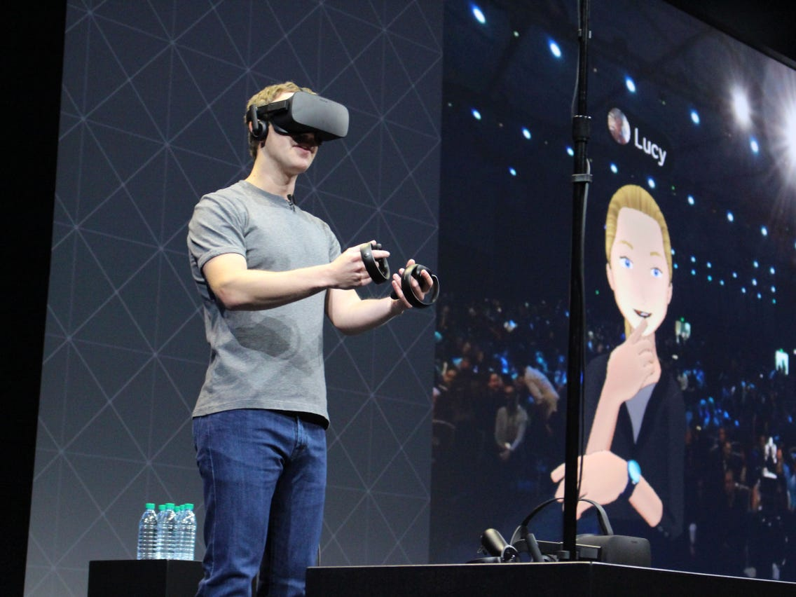

- 就在 7 月份扎克伯格更是公开宣传要把 Facebook 在 5 年内转型成为一家元宇宙公司。
  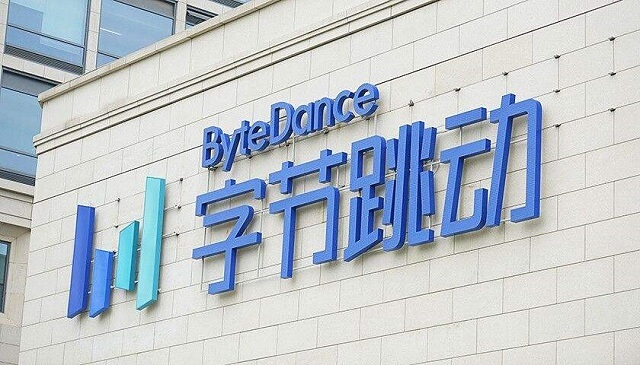

- 就在前些日子字节跳动力压腾讯公司亿 50 亿重金收购了虚拟现实社交产品 pixsoul 开始其元宇宙的布局

  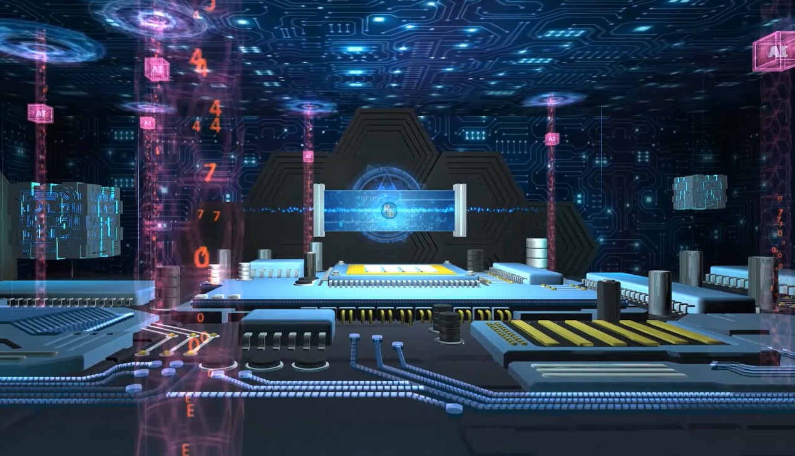

- 百度在  8 月份也退出百度 VR 希壤平台，腾讯也投入了大量元宇宙概念的游戏

包括微软、谷歌、苹果或多或少都在积极地投入到元宇宙未来愿景的探索，所以元宇宙正在作为风口收到所有专业投资者们一致的青睐。

#### 元宇宙是什么

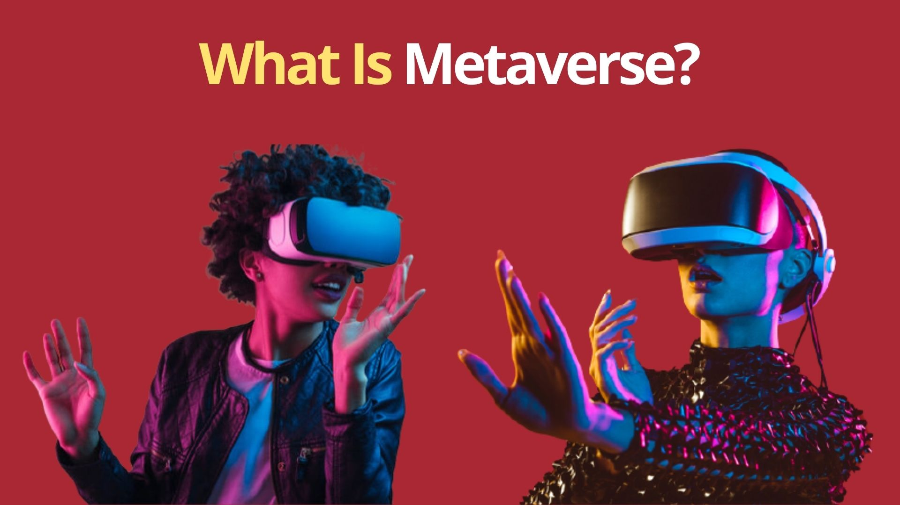

上面说了一大堆，各大公司都在着手筹备搭建自己的元宇宙，那么到底什么是元宇宙呢，其实现在还没有一个完整或者说是统一关于元宇宙是什么的定义。各大公司对于元宇宙定义也是各不相同。

- 可以将元宇宙任务是一个平行的虚拟网络世界
- 开发一个虚拟的共享空间，从而创建一个新的文明和共识，可以理解为所有虚拟世界增强现实和互联网的总和
  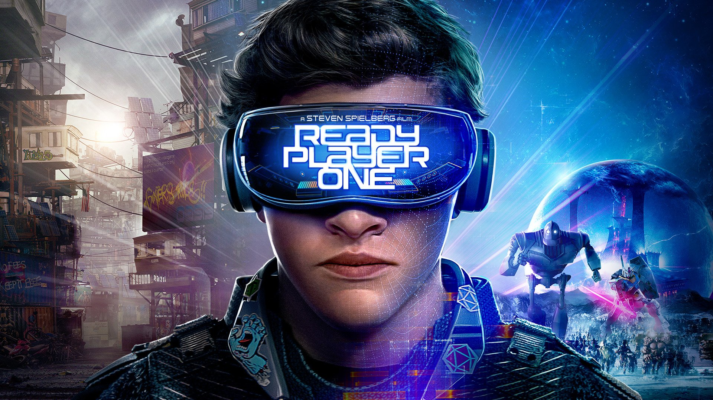
- 在 2018 年斯皮尔伯格的《头号玩家》的绿洲给大家在视觉上展示了一个元宇宙的一个发展方向。在这部电影探索了人工智能运用在游戏中的可能性。

接下来我们在看一看Roblox 提出了元宇宙具备一些性质，Roblox 提出作为元宇宙需要具备以下 8 性质

#### 元宇宙 8 要素

- **身份**(Identity): 你拥有一个虚拟身份，无论与现实身份有没有相关性
- **朋友**(Friends): 拥有朋友，可以社交
- **沉浸感**(Immersive): 能够沉浸在元宇宙的体验当中
- **低延时**(Low latency): 元宇宙中的一切都是同步发生，没有异步性或延时性
- **多元化**(Variety): 元宇宙提供多种丰富内容，包括玩法，道具、美术素材
- **随时随地**(Anywhere): 可以用任何设备登录元宇宙，随时随地沉浸其中
- **经济系统**(Economy): 拥有自己的经济系统
- **文明**(Civility): 元宇宙应该是一种虚拟的文明

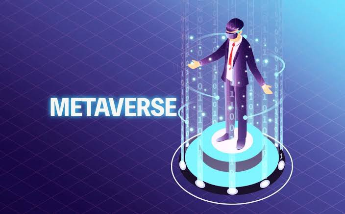

#### 给出你的答案

有了上面各种对元宇宙的定义，以及一些关于元宇宙零散碎片的知识，想必大家都已经对什么是元宇宙有了一定认知，还希望大家多多参与在评论区给出自己关于元宇宙的定义。

在给出你自己答案前我们先看看各大公司关于元宇宙的定义。
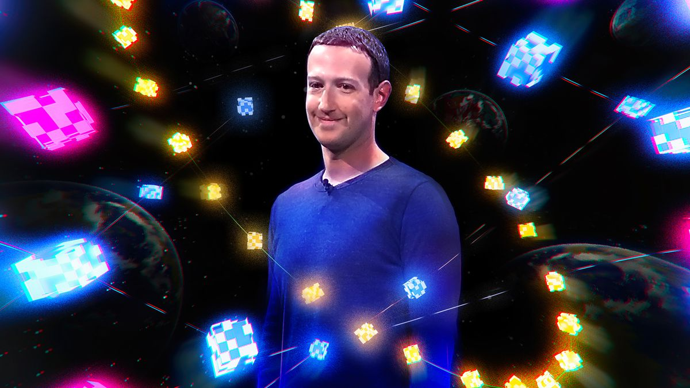

- 扎克伯格关于元宇宙定义，元宇宙就是一个融合了虚拟现实技术，用专属的硬件设备打造的一个具有超强沉浸感的社交平台
  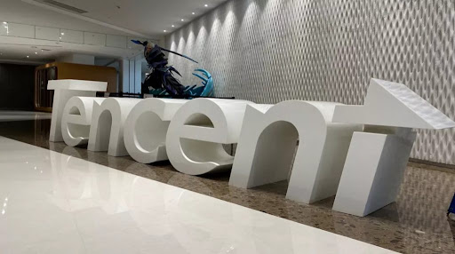
- 按照腾讯的元宇宙做概念，是一个独立于现实世界的虚拟数字世界，用户进入到这个世界之后，可以用新的身份开启全新的自由生活，马化腾还为这个概念起了一个新的名字，叫做全真互联网
  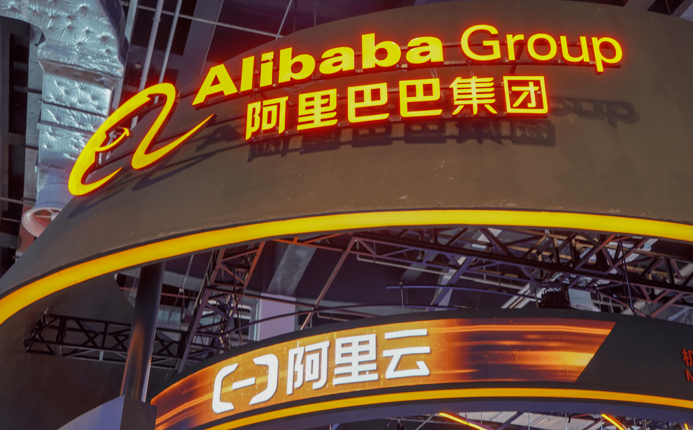
- 而阿里巴巴元宇宙是允许商家自行搭建 3D 购物空间，让顾客进入天猫店铺以后可以一种云逛街的全新购物感受
- Roblox 的目标就是建立一个让用户能够尽情创建内容，并且在虚拟社区中交流和成长的在线游戏

元宇宙中包罗万象，是一个无限接近真实的虚拟现实场景，是一个与现实世界互相独立平行，而又在各个方面互相可以形成替代的世界，现实世界里面的尔虞我诈、悲欢离合、阶级权贵都可以形成一个一一对应的体会，这是一个无限接近真实又是在程序里面的一个世界。

#### 元宇宙不仅是虚拟现实+社交、购物或者游戏

当然元宇宙并不是简单虚拟现实结合不同领域的应用程序，元宇宙不应该是可安装和卸载的一个应用程序，而应该是系统或者平台

#### 元宇宙是新瓶装旧酒?

有人可能会提出质疑，所谓的元宇宙不就是大型多人在线角色扮演游戏吗，如果简单将元宇宙理解为大型多人在线角色扮演游戏，那你可能就误解了元宇宙，其中个人元宇宙与大型多人在线角色扮演游戏不同就是元宇宙是和现实世界是相通的。

#### 什么是随时随地的沉浸式体验

什么是进入元宇宙的传送门呢? 现在 VR 技术已经相对成熟，但是由于 VR 设备，如头盔佩戴不是很方便，而且具有局限性。所以 VR 暂时还无法承担作为进入元宇宙的传送门的任务。轻便眼镜结合像手机这样的硬件设备倒是暂时解决元宇宙入口的一个不错解决方案。

在下一期会谈到元宇宙的永远存在、去中心化和如何与现实相连。

下一个风口就是元宇宙

元宇宙突破限制

元宇宙如何与现实连接

#### 永远存在

元宇宙永远不会熄灭，那么元宇宙就会一直在，就像真实世界一样，元宇宙中的用户可以更替，玩法可以变化，规则也可以调整

#### 去中心化

少不了的底层协议

#### 与现实相连

元宇宙需要用户在元宇宙

是不是元宇宙是将真实世界往虚拟世界一次迁移，或者我们用数字来模拟出一个属于玩家的真实世界呢?

元宇宙是一场现实世界与数字世界的接口革命，元宇宙出现是一定背景的，今天随着互联网迅速发展，沉淀了大量数据，这些数据取自与我们人类社会各个领域、例如经济活动、医疗领域、出行和活动，